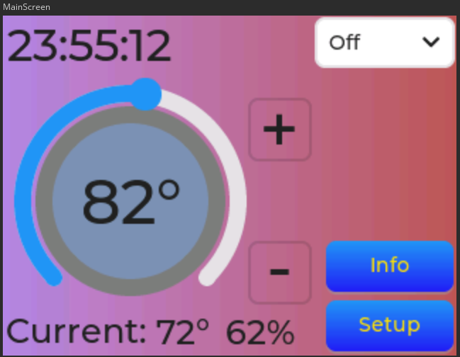
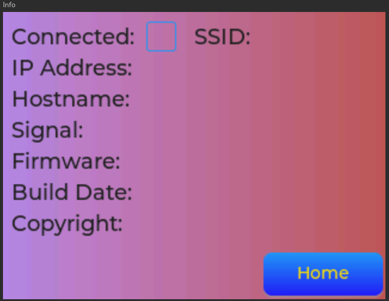
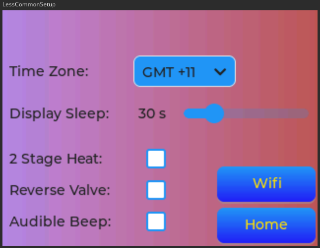

# Smart Thermostat

The idea of this project is to create a truly smart thermostat.
Main features are:

* Can be integrated into a home automation system (such as Home Assistant)
* Cloud connection not required
* Wifi connected
* Initial setup (e.g., Wifi credentials) configured via touch screen interface
* Will act similarly to a person's preferences when it comes to HVAC. For example:
    * the temperature set should be dependent upon local forecast
    * If the outside temp is close to the set thermostat temp, suggest opening a window
    * Detect if a window or door is open and disable the heat/AC
* Use Matter protocol over Wifi (thermostat V2)
* Provide local web site to control/configure thermostat
* Allow ssh login
* Provide diagnostic logging (rsyslog as well?)
* Detect degradation of temp rise/fall to identify clogged filter or service required
* Employ remote temp sensors to balance temp within home
* Detect lower air quality to suggest opening a window (and disable HVAC)
* No mechanical buttons - soft buttons on the TouchScreen only ... except maybe a master reset if things go wrong!

Basic layout of thermostat:


# December 18, 2023 Changes to MQTT and addition of telnet support

Version 0.7.2 adds support for telnet and soft backlight bring up (more on that later). It also fixes a handful of bugs and reliability (especially around MQTT) has been dramatically increased.

Prior to this release, the backlight would come on immediately with "full brightness" (depending on the ambient light level). Now, the logic has been updated to bring the backlight up slowly to match the current room light level. Also the backlight will continue to match the detected light, so if you turn the room light on, it will match.

Auto reconnect in the ESP MQTT module has been enabled. This eliminates the responsibility for smart-thermostat to re-establish an MQTT connection if it is lost. Trying to do this manually led to race conditions and some incorrect logic assumptions. Now the built-in module (from Esspressif) handles it ... and it is incredibly reliable!

Telnet support has been added! There is no credential checking mechanism, but this is not a high security device. It could be added later by a contributor if wanted. Via telnet, a user can reconfigure the stat, monitoring the logging output, reboot and check on stats & error counts.

# October 4, 2023 addition of Matter support

Getting started: https://docs.espressif.com/projects/esp-matter/en/latest/esp32/developing.html

Matter support is delayed until the SDK can be added as a library to PlatformIO. Currently, the actions required to create a dev environment is too extreme.

# September 8, 2023 update - V0.6

The thermostat app code is now 100% ESP-IDF based. All dependencies on the Arduino framework have been removed. This provides for much better control of the code and better integration with the upcoming Matter implementation.

FYI: There are some libraries being used that have some compile-time errors. These are currently being worked with the maintainers. See PR comments.

FYI #2: Many details have changed with today's commit (such as the partition scheme). It is best to clear out old builds and be sure everything (ESP-IDF and libraries) are up-to-date. Details in the platformio.ini file.

# May 2023 update - V0.2

Great progress! The processor has been selected, the ESP-32 and the user interface is (albeit crude) created! To generate the user interface elements and menuing system, [SquareLine Studio](https://squareline.io/) was used. This integrates with the graphics library used; [LVGL](https://lvgl.io/).

## Operating environment

FreeRTOS will be the OS. Tasks are created to drive the user interface, the state machine, the web server and reading of the sensors. The state machine will make up the primary task that runs on a continuous, low-priority loop. The user interface task, which drives the TFT is the highest priority. All other tasks will have higher priorities.

The code is currently exceeding the usual partitioning table, so the large_app partition scheme was used. OTA update has not been tried since switching to this partition scheme, but it may now be broken. Later with an ESP32 chip with a larger FLASH should be able to handle the code and perform OTA updates.

## MCU

The processor of choice is the ESP32 with 4MB FLASH.

The choice to use an Espressif MCU was made since it is cheaper, smaller and more simple to integrate into the circuit. It also provides enough GPIO pins to control everything.

Eventually, the ESP32-C6 will be used as it has support for [802.15.4 (Zigbee / Thread)](https://en.wikipedia.org/wiki/IEEE_802.15.4). But it does not have enough GPIO pins, so a multiplexer must be added to the PCB. Alternatively, Wifi plus Matter could be used and skip Zigbee and Thread. This is still under investigation.

Built onto the PCB is a SWD interface allowing GDB debugging, as well as loading firmware. 

Currently, build output shows:

```
Processing esp32dev (platform: espressif32; board: esp32dev; framework: arduino)
---------------------------------------------------------------------------------------------------------------------------------------------------------------------------------
Verbose mode can be enabled via `-v, --verbose` option
CONFIGURATION: https://docs.platformio.org/page/boards/espressif32/esp32dev.html
PLATFORM: Espressif 32 (6.3.0) > Espressif ESP32 Dev Module
HARDWARE: ESP32 240MHz, 320KB RAM, 4MB Flash
DEBUG: Current (esp-prog) External (cmsis-dap, esp-bridge, esp-prog, iot-bus-jtag, jlink, minimodule, olimex-arm-usb-ocd, olimex-arm-usb-ocd-h, olimex-arm-usb-tiny-h, olimex-jtag-tiny, tumpa)
PACKAGES: 
 - framework-arduinoespressif32 @ 3.20009.0 (2.0.9) 
 - tool-esptoolpy @ 1.40501.0 (4.5.1) 
 - tool-mkfatfs @ 2.0.1 
 - tool-mklittlefs @ 1.203.210628 (2.3) 
 - tool-mkspiffs @ 2.230.0 (2.30) 
 - toolchain-xtensa-esp32 @ 8.4.0+2021r2-patch5
LDF: Library Dependency Finder -> https://bit.ly/configure-pio-ldf
LDF Modes: Finder ~ deep, Compatibility ~ soft
Found 42 compatible libraries
Scanning dependencies...
Dependency Graph
|-- LovyanGFX @ 1.1.6
|-- Adafruit AHTX0 @ 2.0.3
|-- Smoothed @ 1.2.0
|-- micro-timezonedb @ 1.0.2
|-- lvgl @ 8.3.7
|-- Preferences @ 2.0.0
|-- ESPmDNS @ 2.0.0
|-- Update @ 2.0.0
|-- WebServer @ 2.0.0
|-- WiFi @ 2.0.0
Building in release mode
Retrieving maximum program size .pio/build/esp32dev/firmware.elf
Checking size .pio/build/esp32dev/firmware.elf
Advanced Memory Usage is available via "PlatformIO Home > Project Inspect"
RAM:   [===       ]  33.1% (used 108372 bytes from 327680 bytes)
Flash: [=====     ]  45.9% (used 1445209 bytes from 3145728 bytes)
Configuring upload protocol...
AVAILABLE: cmsis-dap, esp-bridge, esp-prog, espota, esptool, iot-bus-jtag, jlink, minimodule, olimex-arm-usb-ocd, olimex-arm-usb-ocd-h, olimex-arm-usb-tiny-h, olimex-jtag-tiny, tumpa
CURRENT: upload_protocol = esptool
Looking for upload port...
Using manually specified: /dev/ttyUSB1
Uploading .pio/build/esp32dev/firmware.bin
esptool.py v4.5.1
Serial port /dev/ttyUSB1
Connecting.....
Chip is ESP32-D0WD-V3 (revision v3.0)
Features: WiFi, BT, Dual Core, 240MHz, VRef calibration in efuse, Coding Scheme None
Crystal is 40MHz
MAC: 78:21:84:e2:28:1c
Uploading stub...
Running stub...
Stub running...
Changing baud rate to 921600
Changed.
Configuring flash size...
Flash will be erased from 0x00001000 to 0x00005fff...
Flash will be erased from 0x00008000 to 0x00008fff...
Flash will be erased from 0x0000e000 to 0x0000ffff...
etc...
```

## Touch screen

The TFT display chosen is the [MSP3218](http://www.lcdwiki.com/3.2inch_SPI_Module_ILI9341_SKU:MSP3218) with the ILI9341 TFT driver and the XPT2046 touch controller. LVGL supports this display nicely (see lvgl_conf.h). The 3.2" screen is a bit tight for all menus and controls, but with a stylus, it is fine ... might be tough with a finger.

SquareLine Studio designed screens:<br>






## Power Supply

Built into the PCB is a power supply capable of providing stable 5V DC for the processor and sensors. An LM2576HVT-5 will be used to allow for 24V in and still remain stable regulating the power.

[LM2576HVT Datasheet](https://www.ti.com/general/docs/suppproductinfo.tsp?distId=10&gotoUrl=https%3A%2F%2Fwww.ti.com%2Flit%2Fgpn%2Flm2576hv)

A low dropout voltage regulator is incorporated into the PCB to regulate the 5V to 3v3. [AMS1117 Datasheet](http://www.advanced-monolithic.com/pdf/ds1117.pdf)

## Sensors

Other than an onboard Temp/Humidity/Air quality sensor setup, there can also be remote sensors (maybe connected via MQTT or proprietary ethernet protocol?) that will provide data to make various decisions. These could be inside the home, outside or even from online sources (such as local weather sites).

To measure indoor temp & humidity, the [Aosong AHT20](http://www.aosong.com/userfiles/files/media/Data%20Sheet%20AHT20.pdf) is being used. More manufacturer information can be found [HERE](http://www.aosong.com/en/products-32.html).

A light sensor (LDR) is currently incoporated into the PCB (as a voltage divider) and is being measured for ambient light. It will be used to determine brightness of the TFT display when it is woken.

Motion sensing is being done with the Hi-Link LD2410 uWave sensor. These are available on [Amazon](https://www.amazon.com/Microwave-Radar-Sensor-Module-LD2410-24GHz-ISM-Band-Human-Presence-Motion-Sensing-Module-Non-Contact-Monitoring-Detector-Support-GPIO/dp/B0BP67N9BB) and [AliExpress](https://m.aliexpress.com/item/1005004351593073.html).

* LD2410 documentation: https://drive.google.com/drive/folders/1p4dhbEJA3YubyIjIIC7wwVsSo8x29Fq-?spm=a2g0o.detail.1000023.17.93465697yFwVxH
* Example use in another poject: https://github.com/LoopOnCode/UnitySensor
* You can purchase a Unity Sensor at: https://loopon.tech/products/unity-sensor


## Possibilities

#### Integrate SMS/chat ability

This can be used to notify user of events/alerts. Could also be Slack or other notifications. An onboard annunciator (like a speaker) feels wrong.

#### Use super capacitor to maintain power during power outage

This would maintain power during brief power outages

***

V1 task list:

* [x] Build 24VAC to 5VDC power supply with minimal ripple (< 2%)
* [x] Decide on MCU/SBC
* [x] Determine sensors to be used (temp, humidity, air quality)
* [x] Develop V1 of host app (to get basic thermostat functionality)
* [x] Generate schematic & PCB
* [x] Generate PCB BOM (compatible with JLCPCB parts list)
* [x] Have PCB manufactured (JLCPCB)
* [x] Add OTA update ability (via web page)

V2 task list:

* [x] Design device web page; crude but done
* [x] Design 3D printed case (Polycase may be good supplier or JLCPCB)
* [ ] Implement Matter
* [ ] Develop Home Assistant integration (maybe via Matter?)
* [x] Add MQTT/HA communications (publish and subscriber support)

Maybe:

* [ ] Add air quality monitoring (to PCB and app)

General to-do:

* [ ] Measure current draw of entire thermostat, TFT LED backlight on & off
* [ ] Measure current draw with no TFT display attached
* [ ] Measure voltage ripple while under load
* [x] Redesign PCB to incoporate ESP chip and tighten up layout
* [x] Add serial output pins to connect serial terminal to catch print statements

## Specs...
 
#### FreeRTOS Elements:
 
* Interrupt: Touch
* When: User touches display; Asserts line LO
<br>

* Interrupt: Motion
* When: LD2410 senses motion; asserts line HI
<br>

* Task: aht
* Freq: 10 secs
* Purpose: update temp & humidity
<br/>

* Task: touch
* Freq: int (triggered indirectly via TFT touch int)
* Purpose:
  - Update last touch point
  - Play audible beep
<br>

* Task: motion
* Freq: int (triggered directly via motion int)
* Purpose: update last motion detected timestamp
<br/>

* Task: state-machine
* Freq: 1 sec
* Purpose:
  - Pump state machine
  - Using temp & humidity, motion, last touch pt,
  - Call routines to navigate menus (options / settings)
  - Adjust display brightness (when on) based on LDR
  - Turn off display with no motion

#### States:

* Init (start)
* Idle
* Fan only
* Heat
* Cool
* Error

#### To be added:

* [x] Wifi
* [x] Web server
* [ ] Matter over Wifi
* [x] Telnet
* [x] OTA updates
* [ ] Add air quality monitoring device -- Maybe a future feature

#### Parameters set by user:

* Wifi credentials
* Location (zip code) for outdoor temp - or URI for local/private temp sensor
* Home Assistant FQDN / IP
* Temp swing
* Max / min temp (when to alert user)
* email list / SMS for notifications
* c / f
* reversing valve (for a heat pump)
* auto changeover (A/C to/from Heat)

#### Calculated params:

* Average temp change rate vs temp differential (inside / outside temps)
    * When value exceeded (based on HVAC mode), ask if window/door is open
* Average temp change rate
    * Detects when filter / furnace needs servicing
    * Used to calculate time to temp
